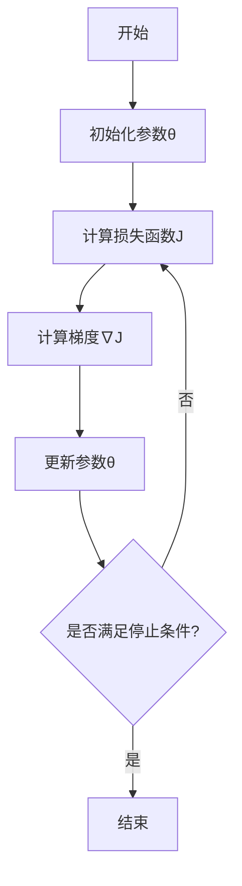

# 梯度下降

梯度下降（Gradient Descent）是机器学习和深度学习中非常重要的一种优化算法。它用于寻找函数的最小值点，在机器学习中通常用于最小化损失函数，从而优化模型参数。

## 基础概念

在理解梯度下降之前，我们需要先了解几个基本概念：

1. **函数与损失函数**：在机器学习中，我们通常定义一个函数来衡量模型预测值与真实值之间的差距，这个函数被称为损失函数（Loss Function）或代价函数（Cost Function）。损失函数的值越小，说明模型的预测效果越好。

2. **梯度**：梯度是一个向量，表示函数在某一点处变化最快的方向。对于单变量函数，梯度就是导数；对于多变量函数，梯度是由各个偏导数组成的向量。

3. **优化目标**：梯度下降的目标是找到一组模型参数，使得损失函数的值最小。

## 数学原理

梯度下降的核心思想是沿着函数梯度的反方向逐步调整参数，以达到函数的最小值点。

对于一个函数 $J(\theta)$，其中 $\theta$ 是模型参数，梯度下降的更新公式为：

$$\theta = \theta - \alpha \cdot \nabla J(\theta)$$

其中：
- $\theta$ 是模型参数
- $\alpha$ 是学习率（Learning Rate），控制每次更新的步长
- $\nabla J(\theta)$ 是损失函数 $J(\theta)$ 的梯度

### 算法步骤

1. 初始化模型参数 $\theta$
2. 计算损失函数 $J(\theta)$
3. 计算梯度 $\nabla J(\theta)$
4. 更新参数 $\theta = \theta - \alpha \cdot \nabla J(\theta)$
5. 重复步骤2-4，直到满足停止条件

### 流程图

## 不同类型的梯度下降

根据每次更新参数时使用的数据量，梯度下降可以分为以下几种类型：

1. **批量梯度下降（Batch Gradient Descent）**：
   - 使用全部训练数据计算梯度
   - 收敛稳定但速度较慢
   - 需要大量内存存储数据

2. **随机梯度下降（Stochastic Gradient Descent, SGD）**：
   - 每次只使用一个样本计算梯度
   - 收敛速度快但可能不稳定
   - 内存需求小

3. **小批量梯度下降（Mini-batch Gradient Descent）**：
   - 使用一小批样本计算梯度
   - 结合了前两者的优点
   - 是实际应用中最常用的方法

## 优缺点和应用场景

### 优点：
- 实现简单，易于理解
- 在处理大规模数据时相对高效
- 可以应用于各种可导函数的优化

### 缺点：
- 需要手动调整学习率
- 可能陷入局部最优解
- 对特征缩放敏感

### 应用场景：
- 线性回归
- 逻辑回归
- 神经网络训练
- 各种机器学习模型的参数优化

## 实际案例

以线性回归为例，假设我们有一组数据点，希望通过梯度下降找到最佳拟合直线 $y = wx + b$ 的参数 $w$ 和 $b$。

损失函数定义为：
$$J(w, b) = \frac{1}{2m} \sum_{i=1}^{m} (wx^{(i)} + b - y^{(i)})^2$$

其中 $m$ 是样本数量。

梯度计算：
$$\frac{\partial J}{\partial w} = \frac{1}{m} \sum_{i=1}^{m} (wx^{(i)} + b - y^{(i)}) \cdot x^{(i)}$$
$$\frac{\partial J}{\partial b} = \frac{1}{m} \sum_{i=1}^{m} (wx^{(i)} + b - y^{(i)})$$

参数更新：
$$w = w - \alpha \cdot \frac{\partial J}{\partial w}$$
$$b = b - \alpha \cdot \frac{\partial J}{\partial b}$$

通过不断迭代更新参数，最终可以找到使损失函数最小的 $w$ 和 $b$ 值，从而得到最佳拟合直线。