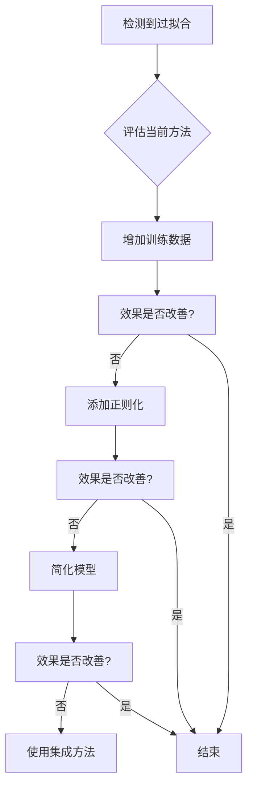
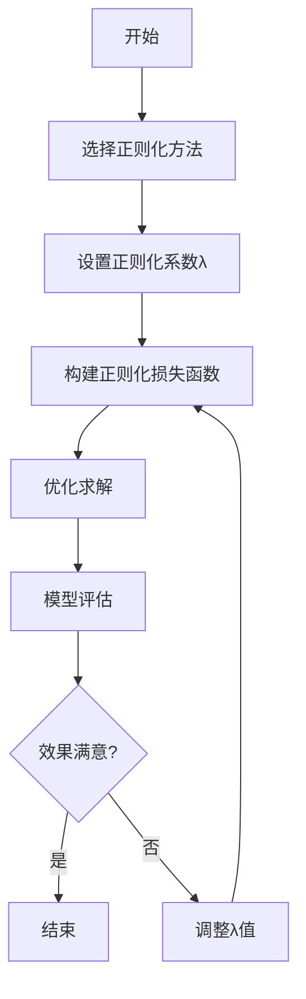
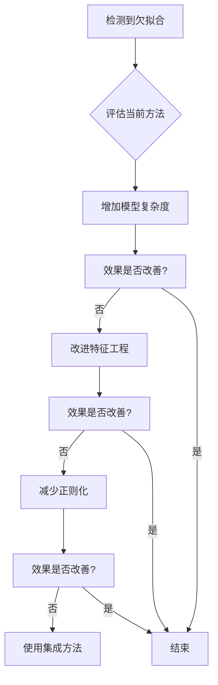

# 正则化详解

正则化（Regularization）是机器学习中一种重要的技术，用于防止模型过拟合，提高模型的泛化能力。通过在损失函数中添加正则化项，可以约束模型的复杂度，使模型在训练数据和新数据上都能有较好的表现。

## 基础概念

### 什么是正则化

正则化是在机器学习模型训练过程中，通过在损失函数中添加一个惩罚项来约束模型复杂度的技术。

**通俗理解：**
可以把正则化想象成"模型的节食计划"。就像人需要控制饮食避免过度肥胖一样，模型也需要控制复杂度避免过拟合。正则化就像是给模型设置了一个"饮食限制"，防止它变得过于复杂。

**技术定义：**
正则化是一种在优化目标函数时添加额外约束的技术，通过引入惩罚项来限制模型参数的大小或稀疏性，从而控制模型复杂度，提高泛化能力。

**核心目标：**
1. **防止过拟合**：减少模型对训练数据的过度记忆
2. **提高泛化能力**：使模型在新数据上表现更好
3. **控制模型复杂度**：避免模型过于复杂导致的性能下降

### 过拟合与正则化的关系

**过拟合现象：**
- 模型在训练集上表现很好，但在测试集上表现较差
- 模型记住了训练数据的细节和噪声，而不是学习一般规律
- 模型复杂度过高，参数过多

**正则化的作用：**
- 通过惩罚项约束模型参数，防止参数过大
- 降低模型复杂度，提高泛化能力
- 在训练误差和模型复杂度之间找到平衡

### 如何解决过拟合

解决过拟合是提高模型泛化能力的关键，有多种方法可以采用：

**1. 正则化方法**
- L1/L2正则化：在损失函数中添加参数惩罚项
- Dropout：在神经网络中随机丢弃神经元
- Early Stopping：监控验证集性能，及时停止训练

**2. 数据相关方法**
- 增加训练数据：收集更多数据或使用数据增强技术
- 数据清洗：去除噪声和异常值
- 特征选择：去除不相关或冗余特征

**3. 模型相关方法**
- 简化模型：减少模型复杂度，降低参数数量
- 集成方法：使用模型集成减少方差
- 交叉验证：使用交叉验证评估模型性能

**4. 其他方法**
- 批量归一化：标准化每层输入，具有正则化效果
- 添加噪声：在输入或参数中添加噪声
- 减少训练时间：避免过度训练

#### 解决过拟合的流程图



### 正则化的基本原理

正则化通过修改损失函数来实现：
$$L_{total} = L_{original} + \lambda R(w)$$

其中：
- $L_{total}$ 是总损失函数
- $L_{original}$ 是原始损失函数
- $\lambda$ 是正则化系数，控制正则化强度
- $R(w)$ 是正则化项，通常与模型参数相关

## L1和L2正则化

### L1正则化（Lasso回归）

L1正则化在损失函数中添加参数绝对值的和作为惩罚项。

**数学公式：**
$$L_{total} = L_{original} + \lambda \sum_{i=1}^{n} |w_i|$$

**特点：**
1. **稀疏性**：能够将一些参数压缩到 exactly 0，实现特征选择
2. **不可导点**：在0点不可导，需要特殊优化方法
3. **特征选择**：自动选择重要特征，忽略不重要特征

**几何解释：**
L1正则化的约束区域是菱形（二维情况下），约束边界与等高线在顶点相切时，容易产生稀疏解。

### L2正则化（Ridge回归）

L2正则化在损失函数中添加参数平方和的平方根作为惩罚项。

**数学公式：**
$$L_{total} = L_{original} + \lambda \sum_{i=1}^{n} w_i^2$$

**特点：**
1. **平滑性**：所有参数都会被压缩，但不会变为0
2. **可导性**：处处可导，优化相对简单
3. **稳定性**：能有效防止过拟合，提高数值稳定性

**几何解释：**
L2正则化的约束区域是圆形（二维情况下），约束边界与等高线相切时，参数值会均匀减小。

### L1与L2正则化对比

| 特性 | L1正则化 | L2正则化 |
|------|----------|----------|
| 稀疏性 | 能产生稀疏解 | 不能产生稀疏解 |
| 特征选择 | 自动特征选择 | 无特征选择 |
| 计算复杂度 | 需要特殊优化 | 优化相对简单 |
| 稳定性 | 对异常值敏感 | 对异常值相对稳定 |

### Elastic Net正则化

Elastic Net是L1和L2正则化的结合，同时具有两者的优点。

**数学公式：**
$$L_{total} = L_{original} + \lambda_1 \sum_{i=1}^{n} |w_i| + \lambda_2 \sum_{i=1}^{n} w_i^2$$

**优点：**
1. **结合优势**：同时具有L1的稀疏性和L2的稳定性
2. **特征分组**：能够选择相关特征组
3. **数值稳定**：比纯L1正则化更稳定

## 正则化算法步骤

### 算法流程

1. **选择正则化方法**：根据问题特点选择L1、L2或Elastic Net
2. **设置正则化系数**：确定λ值的大小
3. **修改损失函数**：在原始损失函数中添加正则化项
4. **优化求解**：使用梯度下降等方法优化总损失函数
5. **模型评估**：在验证集上评估正则化效果
6. **参数调整**：根据效果调整正则化系数

### 流程图



## 其他正则化方法

### Dropout

Dropout是一种在神经网络训练过程中随机丢弃神经元的正则化技术。

**工作原理：**
1. 在每次训练迭代中，以一定概率随机将部分神经元输出设为0
2. 测试时使用所有神经元，但需要对输出进行缩放

**优点：**
1. **简单有效**：实现简单，效果显著
2. **防止共适应**：防止神经元之间过度依赖
3. **近似模型集成**：相当于训练了多个子模型的集成

### 数据增强

数据增强通过变换现有数据生成新数据，增加训练数据的多样性。

**常用方法：**
1. **图像数据**：旋转、翻转、缩放、裁剪、颜色变换
2. **文本数据**：同义词替换、回译、随机删除
3. **音频数据**：时间拉伸、音调变换、噪声添加

### 早停法（Early Stopping）

早停法通过监控验证集性能来防止过拟合。

**工作原理：**
1. 在训练过程中同时监控训练集和验证集性能
2. 当验证集性能不再提升时停止训练
3. 返回验证集性能最好的模型参数

### 批量归一化（Batch Normalization）

批量归一化通过对每层输入进行标准化来加速训练并具有正则化效果。

**优点：**
1. **加速训练**：减少内部协变量偏移
2. **正则化效果**：每个批次的统计量有轻微噪声
3. **减少对初始化的敏感性**：使训练更稳定

## 正则化的优缺点和应用场景

### 优点

1. **防止过拟合**：有效控制模型复杂度
2. **提高泛化能力**：在新数据上表现更好
3. **特征选择**：L1正则化能自动选择重要特征
4. **数值稳定性**：L2正则化提高数值计算稳定性
5. **理论基础**：有坚实的数学理论支撑

### 缺点

1. **增加计算复杂度**：需要额外计算正则化项
2. **参数选择困难**：正则化系数需要仔细调优
3. **可能欠拟合**：正则化过强可能导致欠拟合
4. **解释性降低**：某些正则化方法可能降低模型解释性

### 如何解决欠拟合

解决欠拟合需要提高模型的表达能力，使其能够更好地拟合训练数据：

**1. 模型相关方法**
- 增加模型复杂度：添加更多层或更多神经元
- 使用更复杂的模型：从线性模型切换到非线性模型
- 特征工程：构造更有意义的特征
- 减少正则化：降低正则化强度

**2. 训练相关方法**
- 增加训练时间：延长训练轮数
- 调整学习率：使用更合适的学习率
- 改进优化算法：使用更先进的优化器

**3. 数据相关方法**
- 增加特征数量：添加更多相关特征
- 特征交互：创建特征间的交互项
- 特征变换：对特征进行非线性变换

**4. 集成方法**
- 使用集成学习：如Bagging、Boosting等方法
- 模型堆叠：组合多个不同模型

#### 解决欠拟合的流程图



### 应用场景

1. **线性回归**：Ridge回归、Lasso回归
2. **逻辑回归**：防止参数过大
3. **神经网络**：Dropout、批量归一化
4. **高维数据**：特征选择和降维
5. **小样本数据**：防止过拟合

## 实际案例

### 线性回归中的正则化

以房价预测为例，假设我们有多个特征（面积、房间数、位置等）来预测房价。

**不使用正则化：**
```python
# 普通线性回归
from sklearn.linear_model import LinearRegression
model = LinearRegression()
model.fit(X_train, y_train)
```

**使用L2正则化（Ridge回归）：**
```python
# Ridge回归
from sklearn.linear_model import Ridge
# alpha是正则化系数
model = Ridge(alpha=1.0)
model.fit(X_train, y_train)
```

**使用L1正则化（Lasso回归）：**
```python
# Lasso回归
from sklearn.linear_model import Lasso
# alpha是正则化系数
model = Lasso(alpha=0.1)
model.fit(X_train, y_train)
```

**使用Elastic Net：**
```python
# Elastic Net
from sklearn.linear_model import ElasticNet
# alpha是正则化系数，l1_ratio控制L1和L2的比例
model = ElasticNet(alpha=0.1, l1_ratio=0.5)
model.fit(X_train, y_train)
```

### 神经网络中的正则化

在神经网络中，我们可以同时使用多种正则化技术：

```python
import tensorflow as tf
from tensorflow.keras import layers, regularizers

model = tf.keras.Sequential([
    # 使用L2正则化
    layers.Dense(128, activation='relu', 
                kernel_regularizer=regularizers.l2(0.001)),
    # 使用Dropout
    layers.Dropout(0.5),
    layers.Dense(64, activation='relu',
                kernel_regularizer=regularizers.l2(0.001)),
    layers.Dropout(0.5),
    layers.Dense(10, activation='softmax')
])

# 编译模型时也可以添加正则化
model.compile(
    optimizer='adam',
    loss='sparse_categorical_crossentropy',
    metrics=['accuracy']
)
```

通过这些正则化技术的组合使用，可以显著提高模型的泛化能力，防止过拟合，使模型在实际应用中表现更好。