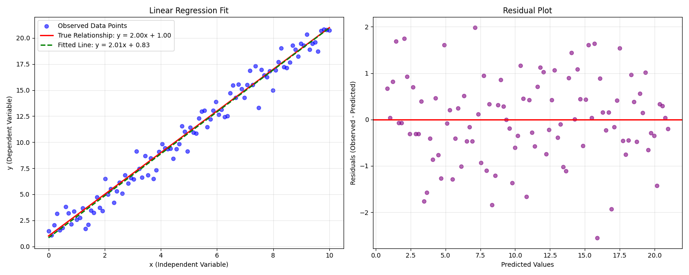
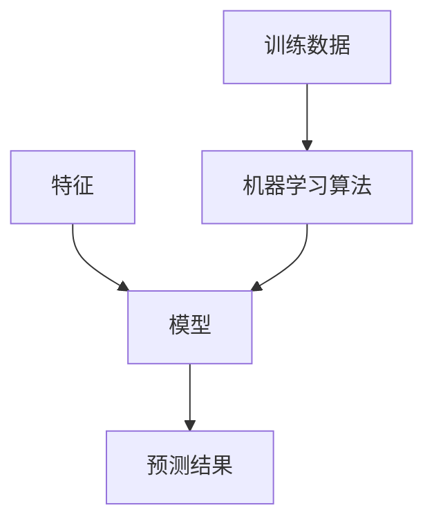

# 认识线性回归

`线性回归(Linear Regression)` 是一种用于预测连续值的最基本的机器学习的算法，它假设目标变量与特征之间存在线性关系，通过拟合一条直线（或超平面）来预测连续值，目标是 `使得预测值与真实值之间的误差最小化`。

这里举一个例子


左侧图形中，蓝色的散点是真实值，红色的直线是我们构建的线性回归方程（假定为 $ y = kx + b $，其中 $ k $ 为斜率、$ b $ 为截距），我们的目标就是找到一条最佳的直线，使得所有散点到直线的距离之和（也就是我们观测的均方误差MSE）最小。

- 如果均方误差是0，则说明我们构建的线性回归方程是最优的，能够完全拟合数据。
- 但是实际上，我们构建的线性回归方程几乎很少做到使均方误差为0，也就是说我们构建的线性回归方程并不是最优的，是对未来的一个大概预测

## 1. 线性回归-符号约定

以如下数据表为例，我们来详细了解线性回归的符号约定

| 建筑面积 | 总层数 | 楼层 | 实用面积 | 房价 |
|---------|---------|---------|---------|---------|
| 143.7 | 31 | 10 | 105 | 36200 |
| 162.2 | 31 | 8 | 118 | 37000 |
| 199.5 | 10 | 10 | 170 | 42500 |
| 96.5 | 31 | 13 | 74 | 31200 |
| ... | ... | ... | ... | ... |

其中
- $ m $ 代表训练集中样本的数量，根据示例表格中的数据来看的话也就是有 4 个样本
- $ n $ 代表特征的数量，表格中有 `建筑面积` `总层数` `楼层` `实用面积` 这 4 个特征
- $ x $ 代表特征/输入变量，也就是表格中的 `建筑面积`、`总层数`、`楼层`、`实用面积` 这些预测房价的变量
- $ y $ 代表目标变量/输出变量，也就是表格中的待预测目标值 `房价`
- $ (x,y) $ 代表训练集中的一个样本，包含了特征向量 $ x $ 和对应的目标值 $ y $
- $ (x^{(i)}, y^{(i)}) $ 代表第 $ i $ 个观察样本，其中 $ x^{(i)} $ 是该样本的特征向量，$ y^{(i)} $ 是对应的目标值
- $ x^{(i)} $ 是特征矩阵中的第 $ i $ 行，是一个包含该样本所有特征值的向量，维度为 $ n $

示例
\[
x^{(2)} = \begin{bmatrix}
162.2 \\
31 \\
8 \\
118
\end{bmatrix}

y^{(2)} = 37000
\]

- $ x^{(i)}_{j} $ 代表特征矩阵中的第 $ i $ 行，第 $ j $ 个特征
示例 $ x^{(2)_{2}}=31   x^{(2)_{3}}=8 $

- $ h $ 代表学习算法的解决方案或者函数，也称为假设（hypothesis）
- $ \hat{y} $ 代表预测值

## 2. 线性回归算法流程



在本节线性回归模型中，该模型为 $ h(x) = w_0 + w_1 * x_1 + w_2 * x_2 + ... + w_n * x_n $
- $ w $ 为 `权重`，给每个特征赋予一个权重
- $ x $ 为 `特征`

简化该公式，我们可以设 $ x_0 = 1 $ ，那么该线性回归方程模型公式（向量化）如下

$ h(x) = w_0 * x_0 + w_1 * x_1 + w_2 * x_2 + ... + w_n * x_n  = w^T * X $
- $ w^T $ 为权重向量的转置
- $ X $ 为特征向量
- 这种向量化的表示方法可以让我们更简洁地表达线性回归模型
- 在实际应用中，我们需要通过训练数据来确定最优的权重向量 $ w $，使得预测值与真实值之间的误差最小化

> [!NOTE]
若表达式为 $ h(x) = w_0 + w_1 * x_1 + w_2 * x_2 + ... + w_n * x_n  + b $，这里的 $ b $ 为偏置项（bias），它与 $ w_0 $ 的作用是相同的，都是为了让模型能够更好地拟合数据。因此在实际应用中，我们通常将偏置项 $ b $ 并入权重向量 $ w $ 中，即令 $ x_0 = 1 $，$ w_0 $ 就相当于偏置项 $ b $。这样可以使模型表达更加简洁。

## 3. 机器学习中的重要术语介绍

在机器学习中，有几个关键的术语需要我们深入理解：

### 3.1 损失函数 (Loss Function)

损失函数用于衡量模型在单个训练样本上的预测效果。它计算预测值与真实值之间的差异，损失函数的值越小，说明模型的预测越准确。

常见的损失函数包括：
- 0-1损失函数：用于分类问题，预测正确得0分，预测错误得1分
- 平方损失函数：计算预测值与真实值差值的平方，适用于回归问题
- 绝对损失函数：计算预测值与真实值的绝对差值
- 对数损失函数：主要用于逻辑回归等概率预测问题

### 3.2 代价函数 (Cost Function)

代价函数是整个训练集上损失函数的平均值，用于评估模型在所有训练样本上的整体表现。

常用的代价函数包括：
- 均方误差(MSE)：各样本平方损失函数的平均值
- 均方根误差(RMSE)：均方误差的平方根，可以保持误差的量纲
- 平均绝对误差(MAE)：各样本绝对损失函数的平均值

### 3.3 目标函数 (Object Function)

目标函数是我们最终需要优化的函数，通常由以下两部分组成：
1. 代价函数：反映模型在训练数据上的拟合程度
2. 正则化项：用于防止模型过拟合，增强模型的泛化能力

在训练过程中，我们的目标是最小化目标函数，从而得到最优的模型参数。

> 注意：在实际应用中，这三个函数的选择需要根据具体问题和数据特点来确定，选择合适的函数对模型的性能有重要影响。

## 4. 最小二乘法(Least Square Method, LSM)

最小二乘法是线性回归中最常用的参数估计方法，其核心思想是最小化预测值与真实值之间的平方误差之和。

### 4.1 基本原理

对于线性回归模型 $h(x) = w^T * X$，我们的目标是找到最优的权重向量 $w$，使得所有样本点的预测值与真实值之间的平方误差之和最小。

均方误差(MSE)计算公式如下
$ J(w) = \frac{1}{2m} \sum_{i=1}^m (h(x^{(i)}) - y^{(i)})^2 $

其中
- $ m $ 是样本数量
- $ h(x^{(i)}) $ 是第 $i$ 个样本的预测值
- $ y^{(i)} $ 是第 $i$ 个样本的真实值
- $ \frac{1}{2} $ 是为了在求导时消除指数

### 4.2 求解过程

为了找到最优的权重向量 $w$，我们需要

1. 将预测函数代入MSE公式
$ J(w) = \frac{1}{2m} \sum_{i=1}^m (w^T * x^{(i)} - y^{(i)})^2 $

2. 对权重向量 $w$ 求偏导数
$ \frac{\partial J(w)}{\partial w} = \frac{1}{m} \sum_{i=1}^m (w^T * x^{(i)} - y^{(i)}) * x^{(i)} $

3. 令偏导数等于0，得到正规方程
$ X^T * X * w = X^T * y $

4. 求解权重向量
$ w = (X^T * X)^{-1} * X^T * y $

```python
def LSM(X, y):
    """
    最小二乘法
    参数:
        X: 特征矩阵
        y: 目标值向量
    返回:
        w: 权重向量
    """
    # np.linalg.inv(): numpy线性代数模块中的求逆矩阵函数
    # X.T: 矩阵X的转置，将mxn的矩阵转为nxm
    # @: 矩阵乘法运算符，等同于np.matmul()，用于计算矩阵乘积
    # 计算步骤：
    # 1. X.T @ X: 计算特征矩阵与其转置的乘积
    # 2. np.linalg.inv(): 计算上述结果的逆矩阵
    # 3. @ X.T @ y: 将逆矩阵与X转置和目标值向量相乘
    w = np.linalg.inv(X.T @ X) @ X.T @ y
    return w
```

### 4.3 几何意义

最小二乘法的几何意义可以理解为：
1. 在二维平面上，它是找到一条直线，使所有样本点到这条直线的垂直距离平方和最小
2. 在高维空间中，它是找到一个超平面，使所有样本点到这个超平面的距离平方和最小

### 4.4 优缺点分析

优点：
- 有封闭解（直接解），计算简单
- 当数据满足高斯分布时，最小二乘法就是最大似然估计
- 结果易于理解和解释

缺点：
- 对异常值敏感
- 当特征之间高度相关时，可能导致矩阵不可逆
- 计算复杂度随特征数量的增加而急剧增加

### 4.5 实际应用注意事项

1. 数据预处理：
   - 特征标准化
   - 异常值处理
   - 多重共线性检查

2. 计算优化：
   - 对于大规模数据，可以使用梯度下降等迭代方法
   - 可以使用正则化方法改善模型的泛化能力

3. 模型评估：
   - 使用交叉验证评估模型性能
   - 检查残差的分布情况
   - 考虑使用其他评估指标（如R²）
