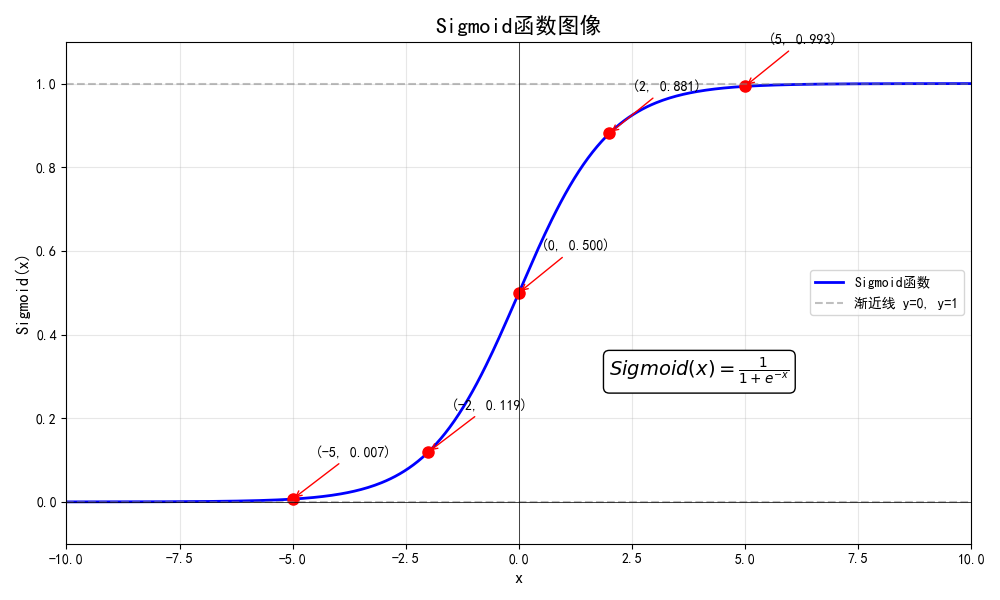

# 逻辑回归(Logistic Regression)之Sigmoid函数

什么是Sigmoid函数？
## 1. 直观理解
Sigmoid 函数是一条“S”形曲线，能把任意实数映射到 0~1 之间，恰好可以解释为“概率”。  
当输入越大，输出越接近 1；输入越小，输出越接近 0；输入为 0 时输出恰好是 0.5。


## 2. 数学定义
最常见形式为  
$$
\sigma(z) = \frac{1}{1 + e^{-z}}
$$  
其中  
- $z \in \mathbb{R}$：可以是任何实数，在逻辑回归里 $z = \mathbf{w}^\top \mathbf{x} + b$  
- $e \approx 2.71828$：自然对数的底

> **WARNING** 若表达式为 $ h(x) = z = w_0 + w_1 * x_1 + w_2 * x_2 + …… + w_n * x_n +b = \mathbf{w}^\top \mathbf{x} + b $，则b可以看作是偏置项（bias），它与w0的作用是相同的，都是为了让模型能够更好地拟合数据。
> 因此在实际应用中，我们通常将偏置项b并入权重向量w中，即令x0 = 1，w0就相当于偏置项b。这样可以使模型表达更加简洁。

## 3. 参数逐层拆解
假设我们有一个样本 $\mathbf{x} = [x_1, x_2, \dots, x_n]$ 和模型参数 $\mathbf{w} = [w_1, w_2, \dots, w_n], b$  
1. 线性组合：$z = w_1x_1 + w_2x_2 + \dots + w_nx_n + b$  
2. 取负号：$-z$  
3. 指数运算：$e^{-z}$  
4. 加 1：$1 + e^{-z}$  
5. 倒数：$\frac{1}{1 + e^{-z}}$ 即得到 0~1 之间的概率值

## 4. Sigmoid函数的逻辑变换
Sigmoid函数的逻辑变换可以将线性模型转换为概率模型，从而可以用于分类问题。
对 Sigmoid 函数求一阶导数：  
令 $g(z)=\dfrac{1}{1+e^{-z}}$，则  
先利用链式法则对分母求导：  
$$
\frac{d}{dz}(1+e^{-z}) = -e^{-z}
$$  
再对倒数函数求导：  
$$
g'(z)=\frac{d}{dz}\left(\frac{1}{1+e^{-z}}\right)
     = -\frac{1}{(1+e^{-z})^2}\cdot (-e^{-z})
     = \frac{e^{-z}}{(1+e^{-z})^2}
$$  
将分子拆成 $(1+e^{-z})-1$：  
$$
g'(z)=\frac{1+e^{-z}-1}{(1+e^{-z})^2}
     =\frac{1}{1+e^{-z}}\cdot\left(1-\frac{1}{1+e^{-z}}\right)
     =g(z)\bigl(1-g(z)\bigr)
$$  
该导数形式简洁，仅依赖函数值本身，便于后续梯度计算与参数更新。

经过这一变换，我们得到的 $g(z)$ 可直接视作样本属于正类（y=1）的估计概率，即  
$$ P(y=1|\mathbf{x};\mathbf{w},b) = \sigma(z) = \sigma(\mathbf{w}^\top \mathbf{x} + b) $$  
相应地，属于负类的概率为  
$$ P(y=0|\mathbf{x};\mathbf{w},b) = 1 - \sigma(z) $$  
于是，Sigmoid 函数把原本取值范围 $(-\infty, +\infty)$ 的线性得分 $z$ 压缩到 $(0,1)$，完成了“线性→概率”的跨越，为后续使用最大似然估计或交叉熵损失进行参数学习奠定了基础。

## 4. 代码实现（Python + NumPy）
```python
import numpy as np

def sigmoid(z):
    """
    计算 Sigmoid 函数的值
    参数:
        z: 输入值
    返回:
        s: Sigmoid 函数的值
    """
    s = 1 / (1 + np.exp(-z))
    return s
```